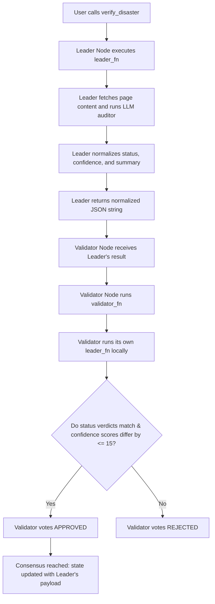

# Disaster Relief Oracle

A decentralized philanthropic/InsurTech primitive built on GenLayer (v0.2.16).

Decentralized autonomous organizations (DAOs) and relief funds often struggle with slow manual verification before disbursing emergency aid. This primitive automates the verification process without relying on expensive, centralized third-party oracles. It takes a `disaster_claim` (e.g. "Region A is under a state of emergency due to severe flooding") and a trusted `source_url` (e.g. a government portal, CNN, or BBC). It uses a decentralized LLM jury to fetch the live webpage, read the data, and determine if the real-world situation matches the claim to authorize relief efforts, outputting a consensus-backed verdict: `VERIFIED`, `REJECTED`, or `UNVERIFIABLE`.

---

## 🌟 Reusable Oracle Primitive (Beyond a "One-Off Demo")

This contract serves as a decentralized crisis verification engine that can be integrated across multiple flows:
1.  **Charity DAOs:** Automatically disburse emergency funds or trigger token releases immediately when a disaster is verified by trusted news sources.
2.  **Parametric Relief Insurance:** Automate relief payouts for parametric climate insurance contracts directly on-chain without human claims adjusting delays.
3.  **Crisis Registry:** Maintain a permanent, public, and auditable ledger of verified disaster regions and the corresponding evidence summaries.

---

## 🏗️ Storage & State Design

The contract maintains state using GenLayer's persistent storage:
*   **`ReliefRecord` (Struct):** An `@allow_storage @dataclass` holding the disaster claim, the source URL, the status (`VERIFIED`, `REJECTED`, or `UNVERIFIABLE`), the validator confidence score (`bigint`), and the evidence summary.
*   **`records` (TreeMap):** A persistent lookup table mapped from `str(record_id)` to `ReliefRecord`.
*   **`next_id` (bigint):** An auto-incrementing ID tracking the total number of relief records.

---

## 🤝 Custom Validator Consensus Logic

Verifying real-world events from unstructured web text requires subjective interpretation. To reach consensus stable against individual model biases, the contract uses a **Custom Validator** via `gl.vm.run_nondet_unsafe(leader_fn, validator_fn)`:



### Consensus Rules:
1.  **Normalization:** The LLM's winner verdict is normalized into either `"VERIFIED"`, `"REJECTED"`, or `"UNVERIFIABLE"`. The confidence score is coerced to a `0..100` integer.
2.  **Verdict Category Equality:** The validator checks if its independent run yields the **exact same status** (e.g., both agree that the claim is `VERIFIED`).
3.  **Confidence Score Banding:** The validator checks if its confidence score is within an **absolute difference of 15 points** of the leader's score (`abs(leader_confidence - mine_confidence) <= 15`).
4.  **Evidence Summary Exemption:** The validator **ignores** differences in the qualitative `evidence_summary` string, preventing consensus failure due to harmless synonym variations in the generated explanation text.

---

## 🧪 Edge Case Testing Guidelines

You can test the contract using GenLayer Studio or CLI using the following scenarios:

### 1. Confirmed Disaster (VERIFIED Path)
*   **Disaster Claim:** "Khu vực [Tên địa phương] đang bị ngập lụt nghiêm trọng và chính quyền đã ban bố tình trạng khẩn cấp."
*   **Source URL:** A reputable online newspaper (CNN, BBC, etc.) reporting the exact storm/flooding and emergency state.
*   **Expected Result:** Status: `VERIFIED`, Confidence: `~90-100`, Evidence Summary confirming the matches.

### 2. Mismatched Event (REJECTED Path)
*   **Disaster Claim:** "Khu vực [Tên địa phương] đang xảy ra động đất cường độ mạnh." (Using the same flooding URL above).
*   **Source URL:** The news article reporting flooding, not an earthquake.
*   **Expected Result:** Status: `REJECTED`, Confidence: `~90-100`, Evidence Summary highlighting the discrepancy (flooding reported instead of earthquake).

### 3. Missing Proof (UNVERIFIABLE Path)
*   **Disaster Claim:** "Severe flooding state of emergency on Oct 10."
*   **Source URL:** A tourism blog or commercial e-commerce store with no mention of natural disasters.
*   **Expected Result:** Status: `UNVERIFIABLE`, Confidence: `~85-100`, Evidence Summary stating that the page does not contain emergency data.

### 4. Edge Case: Empty Fields
*   **Inputs:** `disaster_claim = ""` or `source_url = ""`
*   **Expected Result:** The contract throws a `UserError` immediately.

---

## 🌐 Deployment & Test Evidence

*   **Contract Address:** `0xEd99a85A1a48e67F4588644e77dAA437a28DD2f8`
*   **Network:** `studionet`

### Worked Example (Illustrative Example)

#### Example Call:
```python
contract.verify_disaster(
    disaster_claim="Region A is under a state of emergency due to severe flooding.",
    source_url="https://example.com/news-alert"
)
```

#### Expected Output (JSON from `get_record` view):
```json
{
  "id": "0",
  "disaster_claim": "Region A is under a state of emergency due to severe flooding.",
  "source_url": "https://example.com/news-alert",
  "status": "VERIFIED",
  "confidence": 98,
  "evidence_summary": "The emergency alert confirms that severe flooding and a state of emergency were declared in the northern region."
}
```
*Note: The evidence_summary field is illustrative of the natural language response, while the status and confidence band represent the verified consensus values.*
